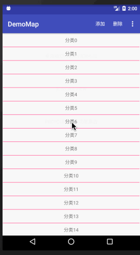

# RecyclerViewDemo





# RecyclerView实现方式

### 第一步：设置布局管理器
用来确定每一个item如何进行排列摆放:

- LinearLayoutManager 相当于ListView的效果

- GridLayoutManager相当于GridView的效果

- StaggeredGridLayoutManager 瀑布流

### 第二步：添加分割线

我们用到了网上流传的万能分割线DividerItemDecoration和DividerGridItemDecoration，首先在style.xml里面定义分割线图片：

1.先在drawable中新建divider.xml 
```xml 
<?xml version="1.0" encoding="utf-8"?>
<shape xmlns:android="http://schemas.android.com/apk/res/android"
    android:shape="rectangle" >
    <solid android:color="@color/colorAccent"/>
    <size android:height="1dp"
        android:width="1dp"/>
</shape>
```

2.然后在style.xml中设置android:listDivider
```xml
        <item name="android:listDivider">@drawable/divider</item>
```

### 第三步：设置适配器
RvAdapter